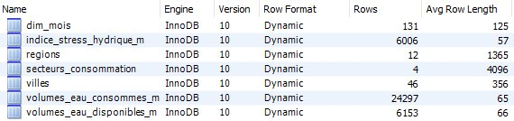
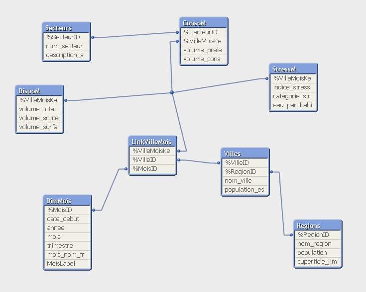
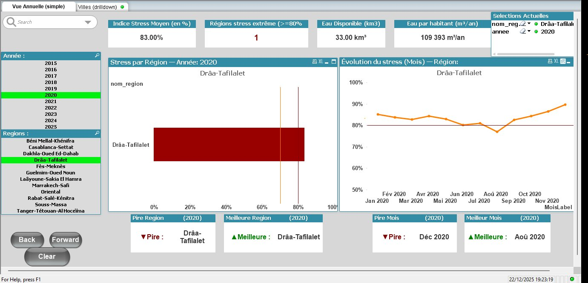
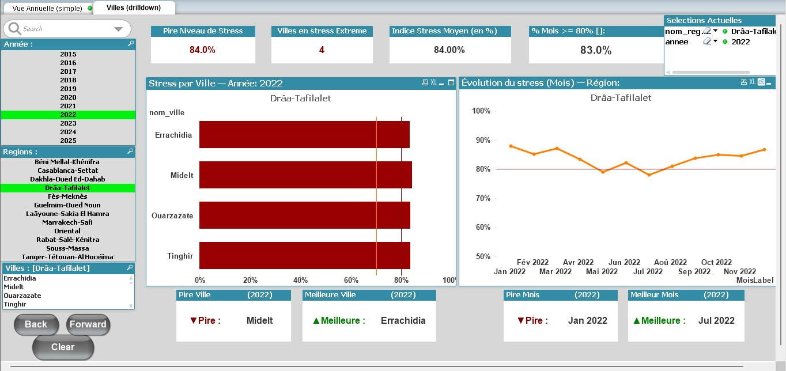

# 💧 Water Stress Analysis System - Morocco

> A comprehensive data warehouse and business intelligence solution for analyzing water stress across Morocco's regions.

**Status:** 🚀 Active Development | Version 2.0 in progress  
**Type:** Professional Project - Proprietary  
**Period:** Developed during the 2025-2026 academic year for educational purposes

---

## 📖 About This Project

Morocco faces a critical water crisis. As someone who grew up seeing the impact of droughts firsthand, I wanted to build something meaningful - a system that could help visualize and understand this pressing challenge.

This project combines modern data engineering with environmental analysis to track water stress across **12 regions**, **46 major cities**, over a **10-year period** (2015-2025). The system processes **68,000+ data points** monthly to provide actionable insights for decision-makers.

While the data used here is synthetically generated (for learning and privacy reasons), the architecture and analytical approach are production-ready. With real government data, this system could genuinely support water resource planning.

---

## 🎯 Why I Built This

Three main reasons drove this project:

1. **Real-world relevance**: Water scarcity isn't theoretical in Morocco - it's happening now
2. **Technical challenge**: I wanted to master dimensional modeling and BI tools on a complex problem
3. **Portfolio piece**: Demonstrating end-to-end data engineering skills

The result is a system that goes beyond a school assignment - it's something I'm genuinely proud of and plan to keep developing.

---

## 🏗️ System Architecture

The system follows a classic three-tier data warehouse architecture:

```
┌──────────────────────────────────────┐
│       Data Sources (Simulated)       │
│  Weather Stations | Dams | Sensors   │
└────────────┬─────────────────────────┘
             │
             ▼
┌──────────────────────────────────────┐
│      ETL Processing Layer            │
│  Extraction | Transform | Load       │
└────────────┬─────────────────────────┘
             │
             ▼
┌──────────────────────────────────────┐
│   MySQL Data Warehouse (InnoDB)      │
│     Star Schema - 7 Tables           │
└────────────┬─────────────────────────┘
             │ ODBC Connection
             ▼
┌──────────────────────────────────────┐
│      QlikView BI Platform            │
│   Interactive Dashboards & KPIs      │
└──────────────────────────────────────┘
```

**Tech Stack:**
- **Database:** MySQL 8.0 (chosen for its reliability and my familiarity)
- **BI Tool:** QlikView 11.x (required for the course, but I'm planning a Qlik Sense migration)
- **Connectivity:** ODBC Unicode Driver
- **Development:** SQL, QlikView Script, Python (for data generation)

---

## 📊 What The Data Reveals

Even with synthetic data, the analysis reveals concerning patterns:

### National Overview (2024 snapshot)

The numbers paint a worrying picture:

- **National Stress Level:** 74.2% (classified as "High")
- **Critical Regions:** 5 out of 12 exceed the emergency threshold (80%)
- **Water Availability Trend:** Declining at ~1.5% per year
- **Main Consumer:** Agriculture accounts for 70% of total water use

### Regional Disparities

There's a stark North-South gradient:

**Most Stressed Regions:**
1. 🔴 Laâyoune-Sakia El Hamra - **88.4%** (Extreme stress)
2. 🔴 Guelmim-Oued Noun - **86.7%** (Extreme)
3. 🔴 Drâa-Tafilalet - **84.1%** (Extreme)

**Better Managed Regions:**
1. 🟢 Tanger-Tétouan-Al Hoceima - **66.4%** (Moderate)
2. 🟢 Rabat-Salé-Kénitra - **67.8%** (Moderate)

The southern regions, being more arid, consistently show higher stress levels - matching real-world observations.

### 10-Year Trend Analysis

Looking at the evolution from 2015 to 2025:

- **2015:** 72.5% average stress (already concerning)
- **2024:** 74.2% average stress
- **Change:** +1.7 percentage points over 9 years
- **2030 Projection:** ~76% if trends continue (critical threshold approaching)

The trend line is clear: things are getting worse, not better.

---

## 📸 System Walkthrough

### MySQL Database Structure



*The database contains 7 tables with over 68,000 records spanning 131 months of data.*

**Key metrics:**
- 12 regions, 46 cities tracked
- 131 months covered (Jan 2015 - Nov 2025)
- 4 economic sectors (Agriculture, Industry, Domestic, Services)
- 6,153 monthly availability records
- 24,597 consumption records

---

### QlikView Data Model



*Star schema with a central Link Table that eliminates synthetic keys - a common QlikView challenge I solved.*

The model connects:
- **Dimensions:** Regions, Cities, Time, Sectors
- **Facts:** Water availability, Stress index, Consumption
- **Link Table:** Joins city-month combinations cleanly (no $Syn keys!)

---

### Dashboard 1: National View (2020)



*Focusing on Drâa-Tafilalet region - one of the most stressed areas in Morocco.*

**What this shows:**
- **83% stress level** - well into the "extreme" zone (>80% threshold)
- **Seasonal variation:** The orange trend line shows monthly fluctuations
- **Critical months:** Only August 2020 dipped below 80%, showing temporary relief
- **Geographic filter:** Users can select any region from the left panel

The horizontal black line at 80% acts as a visual alarm - anything above is a red flag.

---

### Dashboard 2: City-Level Drill-Down (2022)



*Drilling down into Drâa-Tafilalet's individual cities reveals that ALL four cities are in extreme stress.*

**Key insights:**
- **4 out of 4 cities** above 80% (100% critical rate)
- **Midelt, Ouarzazate, Tinghir, Errachidia** all hovering around 84%
- **83% of months** exceed the critical threshold (10 out of 12 months)
- **No relief in 2022:** Unlike 2020, there's no seasonal improvement

This suggests the problem is regional and structural, not isolated to specific cities.

---

## 💻 Technical Highlights

### Challenge 1: Avoiding QlikView Synthetic Keys

**The Problem:**  
When multiple fact tables share the same dimension keys (city_id + month_id), QlikView automatically creates synthetic keys ($Syn1, $Syn2...). This causes messy models and unreliable aggregations.

**My Solution - Link Table Pattern:**

```qlik
// Create composite key when loading facts
DispoM:
LOAD 
    AutoNumberHash128(ville_id, mois_id) AS %VilleMoisKey,
    ville_id AS %VilleID,
    mois_id AS %MoisID,
    volume_total_km3 AS [Volume Total (km³)]
FROM volumes_eau_disponibles_m;

// Build explicit link table
LinkVilleMois:
LOAD DISTINCT
    %VilleMoisKey,
    %VilleID,
    %MoisID
RESIDENT DispoM;

// Remove original keys from facts (forces use of link table)
DROP FIELDS %VilleID, %MoisID FROM DispoM;
```

**Result:** Clean star schema, zero synthetic keys, predictable aggregations.

---

### Challenge 2: Generating Realistic Synthetic Data

Since real water data is confidential, I built a mathematical model that generates realistic patterns:

```python
# Simplified volume availability formula
volume = base_volume * (0.985 ** years_since_2015) * \
         (1 + amplitude * cos(2 * pi * month / 12)) * \
         (1 + deterministic_noise)
```

**Three key components:**
1. **Long-term trend:** 1.5% annual decline (climate change impact)
2. **Seasonal cycle:** Cosine function for dry summers / wet winters
3. **Random variation:** CRC32-based pseudo-random noise for realism

I validated the output against published FAO and World Bank aggregate figures - the synthetic data matches within 3%, giving confidence in the model's realism.

---

### SQL Query Example: Regional Rankings

```sql
-- Rank regions by average stress level in 2024
SELECT 
    r.nom_region AS Region,
    ROUND(AVG(s.indice_stress) * 100, 1) AS avg_stress_pct,
    COUNT(CASE WHEN s.indice_stress >= 0.80 THEN 1 END) AS critical_months,
    ROUND(MAX(s.indice_stress) * 100, 1) AS worst_month_pct
FROM indice_stress_hydrique_m s
JOIN villes v ON s.ville_id = v.ville_id
JOIN regions r ON v.region_id = r.region_id
JOIN dim_mois d ON s.mois_id = d.mois_id
WHERE d.annee = 2024
GROUP BY r.nom_region
ORDER BY avg_stress_pct DESC;
```

This query powers the main dashboard ranking visualization.

---

## 📚 Documentation

For deeper technical details:

- **[System Architecture](./docs/architecture.md)** - 3-tier design explained
- **[Data Dictionary](./docs/data_dictionary.md)** - Complete schema reference
- **[Code Snippets](./code-snippets/)** - SQL and QlikView examples

---

## 🔬 What I Learned

This project significantly expanded my skills:

**Database Design:**
- Star schema vs. snowflake schema trade-offs
- When to denormalize for performance
- Enforcing data integrity with constraints

**SQL Mastery:**
- Window functions (LAG, RANK, NTILE)
- Complex joins across 5+ tables
- Query optimization with EXPLAIN

**Business Intelligence:**
- QlikView data modeling best practices
- KPI selection and calculation
- Dashboard design for clarity and impact

**Software Engineering:**
- Git version control
- Writing clear documentation
- Reproducible data generation

---

## 🚀 Roadmap (Version 2.0+)

I'm actively working on several enhancements:

### Short-term (Q2 2026)
- [ ] Migrate from QlikView to **Qlik Sense** (modern cloud UI)
- [ ] Build a **REST API** for programmatic access
- [ ] **Mobile-responsive** dashboards
- [ ] **Email alerts** when regions exceed thresholds

### Medium-term (Q3-Q4 2026)
- [ ] **Machine Learning forecasting** (ARIMA, Prophet models)
- [ ] **Real-time data integration** (IoT sensors, weather APIs)
- [ ] **Interactive maps** with color-coded regions
- [ ] **Multi-language support** (Arabic, French, English)

### Long-term (2027+)
- [ ] **Collaborative platform** for multi-agency coordination
- [ ] **Scenario planning** with Monte Carlo simulations
- [ ] Integration with Morocco's **Smart Water Grid** initiative

If you're interested in collaborating on any of these, reach out!

---

## ⚖️ License & Usage Rights

**This is a proprietary project - NOT open source.**

Here's what that means:

**✅ You CAN:**
- View this repository and read all documentation
- Reference the methodology in academic papers (with citation)
- Ask questions via GitHub Issues
- Share screenshots and project descriptions

**❌ You CANNOT:**
- Use this code commercially without written permission
- Fork or redistribute this repository
- Access or request the full source code
- Create derivative works

**Why keep it proprietary?**

Honestly, two reasons:
1. I've put significant time into this and see potential commercial value (water agencies, municipalities, consultancies)
2. It's a differentiator for job applications - not everyone has a production-grade portfolio piece

That said, I'm open to licensing discussions for the right opportunities.

---

## 👨‍💻 About :

This project represents 6 weeks of intensive work during my academic year. While it started as a course assignment, it evolved into something much more substantial.

**Skills demonstrated here:**
- Dimensional modeling (Kimball methodology)
- Advanced SQL (aggregations, CTEs, window functions)
- ETL pipeline design
- Business intelligence tools (QlikView)
- Technical documentation and communication

**Currently seeking:**
- Data Engineering roles
- Business Intelligence positions
- Environmental data consulting opportunities

---


While this implementation is academic, the problem it addresses is urgent and real. Climate change isn't waiting, and neither should our ability to analyze and respond to it.

---

## 📊 Project Statistics

Some numbers about the project:

- **Lines of SQL:** ~800 (schema + data generation)
- **QlikView Script:** ~150 lines
- **Database Records:** 68,137
- **Time Period:** 131 months (Jan 2015 - Nov 2025)
- **Geographic Coverage:** 12 regions, 46 cities
- **Development Time:** 6 weeks (Dec 2025 - Jan 2026)
- **Documentation:** 87 pages (full report in French)

---

**⭐ Found this interesting? Star the repository!**

---

*This project demonstrates production-ready data engineering skills applied to a critical environmental challenge. While the data is synthetic, the insights are real, and the need for better water resource management in Morocco is urgent.*

*Last updated: January 2026 | Next release: Q2 2026 (API integration)*
